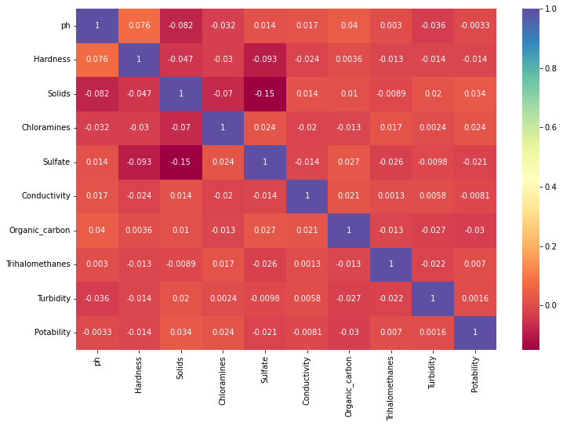
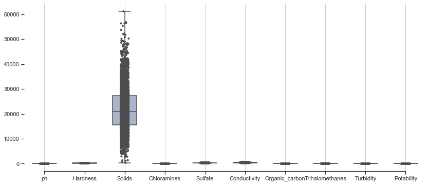
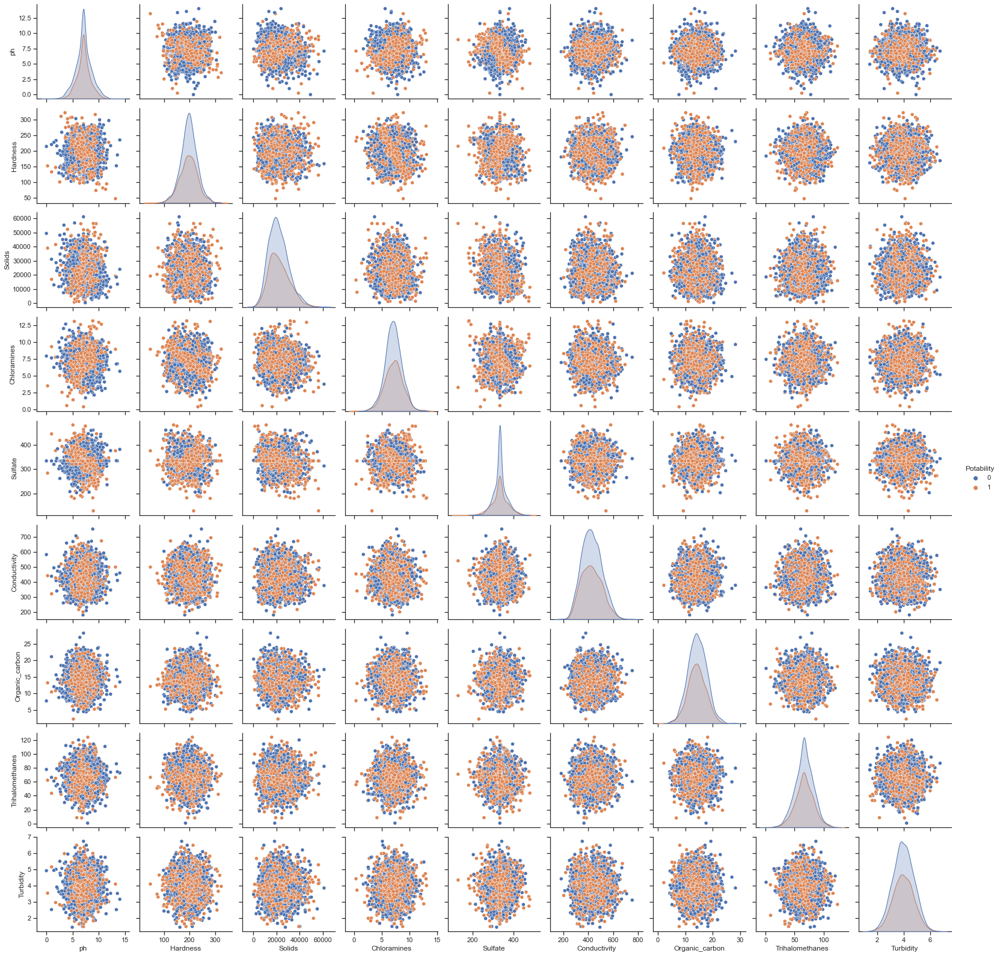
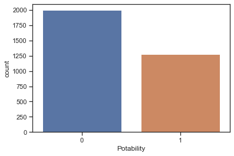
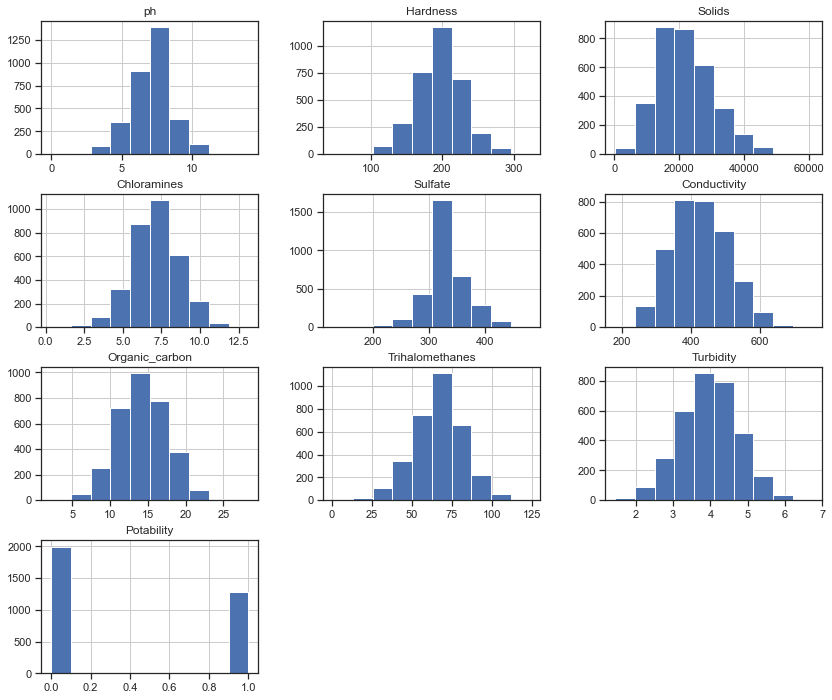

```python
import pandas as pd
import matplotlib.pyplot as plt
import seaborn as sns
```


```python
data = pd.read_csv('Kaggle_EDA/water_potability.csv')
```


```python
data
```


<div>

<table border="1" class="dataframe">
  <thead>
    <tr style="text-align: right;">
      <th></th>
      <th>ph</th>
      <th>Hardness</th>
      <th>Solids</th>
      <th>Chloramines</th>
      <th>Sulfate</th>
      <th>Conductivity</th>
      <th>Organic_carbon</th>
      <th>Trihalomethanes</th>
      <th>Turbidity</th>
      <th>Potability</th>
    </tr>
  </thead>
  <tbody>
    <tr>
      <th>0</th>
      <td>NaN</td>
      <td>204.890455</td>
      <td>20791.318981</td>
      <td>7.300212</td>
      <td>368.516441</td>
      <td>564.308654</td>
      <td>10.379783</td>
      <td>86.990970</td>
      <td>2.963135</td>
      <td>0</td>
    </tr>
    <tr>
      <th>1</th>
      <td>3.716080</td>
      <td>129.422921</td>
      <td>18630.057858</td>
      <td>6.635246</td>
      <td>NaN</td>
      <td>592.885359</td>
      <td>15.180013</td>
      <td>56.329076</td>
      <td>4.500656</td>
      <td>0</td>
    </tr>
    <tr>
      <th>2</th>
      <td>8.099124</td>
      <td>224.236259</td>
      <td>19909.541732</td>
      <td>9.275884</td>
      <td>NaN</td>
      <td>418.606213</td>
      <td>16.868637</td>
      <td>66.420093</td>
      <td>3.055934</td>
      <td>0</td>
    </tr>
    <tr>
      <th>3</th>
      <td>8.316766</td>
      <td>214.373394</td>
      <td>22018.417441</td>
      <td>8.059332</td>
      <td>356.886136</td>
      <td>363.266516</td>
      <td>18.436524</td>
      <td>100.341674</td>
      <td>4.628771</td>
      <td>0</td>
    </tr>
    <tr>
      <th>4</th>
      <td>9.092223</td>
      <td>181.101509</td>
      <td>17978.986339</td>
      <td>6.546600</td>
      <td>310.135738</td>
      <td>398.410813</td>
      <td>11.558279</td>
      <td>31.997993</td>
      <td>4.075075</td>
      <td>0</td>
    </tr>
    <tr>
      <th>...</th>
      <td>...</td>
      <td>...</td>
      <td>...</td>
      <td>...</td>
      <td>...</td>
      <td>...</td>
      <td>...</td>
      <td>...</td>
      <td>...</td>
      <td>...</td>
    </tr>
    <tr>
      <th>3271</th>
      <td>4.668102</td>
      <td>193.681735</td>
      <td>47580.991603</td>
      <td>7.166639</td>
      <td>359.948574</td>
      <td>526.424171</td>
      <td>13.894419</td>
      <td>66.687695</td>
      <td>4.435821</td>
      <td>1</td>
    </tr>
    <tr>
      <th>3272</th>
      <td>7.808856</td>
      <td>193.553212</td>
      <td>17329.802160</td>
      <td>8.061362</td>
      <td>NaN</td>
      <td>392.449580</td>
      <td>19.903225</td>
      <td>NaN</td>
      <td>2.798243</td>
      <td>1</td>
    </tr>
    <tr>
      <th>3273</th>
      <td>9.419510</td>
      <td>175.762646</td>
      <td>33155.578218</td>
      <td>7.350233</td>
      <td>NaN</td>
      <td>432.044783</td>
      <td>11.039070</td>
      <td>69.845400</td>
      <td>3.298875</td>
      <td>1</td>
    </tr>
    <tr>
      <th>3274</th>
      <td>5.126763</td>
      <td>230.603758</td>
      <td>11983.869376</td>
      <td>6.303357</td>
      <td>NaN</td>
      <td>402.883113</td>
      <td>11.168946</td>
      <td>77.488213</td>
      <td>4.708658</td>
      <td>1</td>
    </tr>
    <tr>
      <th>3275</th>
      <td>7.874671</td>
      <td>195.102299</td>
      <td>17404.177061</td>
      <td>7.509306</td>
      <td>NaN</td>
      <td>327.459760</td>
      <td>16.140368</td>
      <td>78.698446</td>
      <td>2.309149</td>
      <td>1</td>
    </tr>
  </tbody>
</table>
<p>3276 rows × 10 columns</p>
</div>


```python
data.info()
```

    <class 'pandas.core.frame.DataFrame'>
    RangeIndex: 3276 entries, 0 to 3275
    Data columns (total 10 columns):
     #   Column           Non-Null Count  Dtype  
    ---  ------           --------------  -----  
     0   ph               2785 non-null   float64
     1   Hardness         3276 non-null   float64
     2   Solids           3276 non-null   float64
     3   Chloramines      3276 non-null   float64
     4   Sulfate          2495 non-null   float64
     5   Conductivity     3276 non-null   float64
     6   Organic_carbon   3276 non-null   float64
     7   Trihalomethanes  3114 non-null   float64
     8   Turbidity        3276 non-null   float64
     9   Potability       3276 non-null   int64  
    dtypes: float64(9), int64(1)
    memory usage: 256.1 KB
    


```python
data.isnull().sum()
```


    ph                 491
    Hardness             0
    Solids               0
    Chloramines          0
    Sulfate            781
    Conductivity         0
    Organic_carbon       0
    Trihalomethanes    162
    Turbidity            0
    Potability           0
    dtype: int64


```python
data.describe()
```


<div>

<table border="1" class="dataframe">
  <thead>
    <tr style="text-align: right;">
      <th></th>
      <th>ph</th>
      <th>Hardness</th>
      <th>Solids</th>
      <th>Chloramines</th>
      <th>Sulfate</th>
      <th>Conductivity</th>
      <th>Organic_carbon</th>
      <th>Trihalomethanes</th>
      <th>Turbidity</th>
      <th>Potability</th>
    </tr>
  </thead>
  <tbody>
    <tr>
      <th>count</th>
      <td>3276.000000</td>
      <td>3276.000000</td>
      <td>3276.000000</td>
      <td>3276.000000</td>
      <td>3276.000000</td>
      <td>3276.000000</td>
      <td>3276.000000</td>
      <td>3276.000000</td>
      <td>3276.000000</td>
      <td>3276.000000</td>
    </tr>
    <tr>
      <th>mean</th>
      <td>7.080795</td>
      <td>196.369496</td>
      <td>22014.092526</td>
      <td>7.122277</td>
      <td>333.775777</td>
      <td>426.205111</td>
      <td>14.284970</td>
      <td>66.396293</td>
      <td>3.966786</td>
      <td>0.390110</td>
    </tr>
    <tr>
      <th>std</th>
      <td>1.469956</td>
      <td>32.879761</td>
      <td>8768.570828</td>
      <td>1.583085</td>
      <td>36.142612</td>
      <td>80.824064</td>
      <td>3.308162</td>
      <td>15.769881</td>
      <td>0.780382</td>
      <td>0.487849</td>
    </tr>
    <tr>
      <th>min</th>
      <td>0.000000</td>
      <td>47.432000</td>
      <td>320.942611</td>
      <td>0.352000</td>
      <td>129.000000</td>
      <td>181.483754</td>
      <td>2.200000</td>
      <td>0.738000</td>
      <td>1.450000</td>
      <td>0.000000</td>
    </tr>
    <tr>
      <th>25%</th>
      <td>6.277673</td>
      <td>176.850538</td>
      <td>15666.690297</td>
      <td>6.127421</td>
      <td>317.094638</td>
      <td>365.734414</td>
      <td>12.065801</td>
      <td>56.647656</td>
      <td>3.439711</td>
      <td>0.000000</td>
    </tr>
    <tr>
      <th>50%</th>
      <td>7.080795</td>
      <td>196.967627</td>
      <td>20927.833607</td>
      <td>7.130299</td>
      <td>333.775777</td>
      <td>421.884968</td>
      <td>14.218338</td>
      <td>66.396293</td>
      <td>3.955028</td>
      <td>0.000000</td>
    </tr>
    <tr>
      <th>75%</th>
      <td>7.870050</td>
      <td>216.667456</td>
      <td>27332.762127</td>
      <td>8.114887</td>
      <td>350.385756</td>
      <td>481.792304</td>
      <td>16.557652</td>
      <td>76.666609</td>
      <td>4.500320</td>
      <td>1.000000</td>
    </tr>
    <tr>
      <th>max</th>
      <td>14.000000</td>
      <td>323.124000</td>
      <td>61227.196008</td>
      <td>13.127000</td>
      <td>481.030642</td>
      <td>753.342620</td>
      <td>28.300000</td>
      <td>124.000000</td>
      <td>6.739000</td>
      <td>1.000000</td>
    </tr>
  </tbody>
</table>
</div>


## Data Cleaning

### Replace all null pH, Sulfate, and Trihalomethanes values with the mean


```python
data.fillna(data.mean(), inplace=True)
```


```python
data.isnull().sum()
```


    ph                 0
    Hardness           0
    Solids             0
    Chloramines        0
    Sulfate            0
    Conductivity       0
    Organic_carbon     0
    Trihalomethanes    0
    Turbidity          0
    Potability         0
    dtype: int64


## EDA


```python
#Check to see if we can do dimensionality reduction
#Use the heatmap plot to see if we have any strong correlations and if so we can drop that feature
plt.figure(figsize=(12, 8))
sns.heatmap(data.corr(), annot=True, cmap='Spectral' )
```


    <AxesSubplot:>


    

    


### As seen in the plot above, there are no feature correlations that have a correlation coefficient higher than 0.082 which comes from the pH and solids

## Take a look at the data distributions


```python
sns.set_theme(style="ticks")

# Initialize the figure 
f, ax = plt.subplots(figsize=(14, 6))

# Plot the orbital period with horizontal boxes
sns.boxplot(data=data, whis=[0, 100], width=.6, palette="vlag")

# Add in points to show each observation
sns.stripplot(data=data, size=4, color=".3", linewidth=0)

# Tweak the visual presentation
ax.xaxis.grid(True)
ax.set(ylabel="")
sns.despine(trim=True, left=True)
```


    

    


### The solids show a large distribution outside of the 1st and 3rd quantiles, we will keep these outliers to improve the accuracy of our model


```python
data.columns
```


    Index(['ph', 'Hardness', 'Solids', 'Chloramines', 'Sulfate', 'Conductivity',
           'Organic_carbon', 'Trihalomethanes', 'Turbidity', 'Potability'],
          dtype='object')


```python
# Shows KDEs instead of histograms along the diagonal and check for normality in distributions of the features
sns.pairplot(data, hue="Potability")
```


    <seaborn.axisgrid.PairGrid at 0x181994105e0>


    

    


## Check for data imbalance


```python
data.Potability.value_counts()
```


    0    1998
    1    1278
    Name: Potability, dtype: int64


```python
sns.countplot(data.Potability)
```

    C:\Users\jonat\anaconda3\envs\mlenv\lib\site-packages\seaborn\_decorators.py:36: FutureWarning: Pass the following variable as a keyword arg: x. From version 0.12, the only valid positional argument will be `data`, and passing other arguments without an explicit keyword will result in an error or misinterpretation.
      warnings.warn(
    


    <AxesSubplot:xlabel='Potability', ylabel='count'>


    

    


### In this prepatory example dataset, we actually have more bad quality than good, but the data is pretty well balanced

### Check again in simple panbas hist plot for normality and see if we need to complete a normalization step before we partition the data


```python
data.hist(figsize=(14,12))
plt.show()
```


    

    


## Data Partitioning


```python
#Input features
X = data.drop('Potability', axis=1)
#Target
y = data.Potability 
```


```python
from sklearn.model_selection import train_test_split
X_train, X_test, y_train, y_test = train_test_split(X, y, random_state=1, test_size=0.2, shuffle=True )
```


```python
y_train
```


    675     1
    1359    0
    1391    0
    1727    0
    1677    0
           ..
    2763    1
    905     0
    1096    1
    235     0
    1061    0
    Name: Potability, Length: 2620, dtype: int64


# Model Training

## Decision tree binary classifier


```python
from sklearn.tree import DecisionTreeClassifier
dt = DecisionTreeClassifier()
```


```python
dt.fit(X_train, y_train)
```


    DecisionTreeClassifier()


```python
y_prediction = dt.predict(X_test)
```


```python
from sklearn.metrics import accuracy_score, confusion_matrix
```


```python
accuracy_score(y_prediction, y_test)*100
```


    60.0609756097561


```python
confusion_matrix(y_prediction, y_test)
```


    array([[254, 143],
           [119, 140]], dtype=int64)


## Initial Training of this model resulted in a False-Negative value of 119 which is undesirable

### Other possible models to test will be:
1. Naive Bayes
2. Logistic Regression
3. K-Nearest Neighbours
4. Support Vector Machine
5. Decision Tree
6. Bagging Decision Tree (Ensemble Learning I)
7. Boosted Decision Tree (Ensemble Learning II)
8. Random Forest (Ensemble Learning III)
9. Voting Classification (Ensemble Learning IV)
10. Neural Network (Deep Learning)

## Model optimization and hyperparameter tuning


```python
from sklearn.model_selection import GridSearchCV
from sklearn.model_selection import RepeatedStratifiedKFold
```


```python
dt = DecisionTreeClassifier()
criterion = ['gini', 'entropy']
splitter = ['best', 'random']
min_samples_split=range(1,11)
parameters = dict(criterion=criterion, splitter=splitter, min_samples_split=min_samples_split)
cv = RepeatedStratifiedKFold(n_splits=5, random_state=1)
grid_search_cv_dt = GridSearchCV(estimator=dt, param_grid=parameters, scoring='accuracy', cv=cv)
```


```python
grid_search_cv_dt.fit(X_train,y_train)
print(grid_search_cv_dt.best_params_)
```

    {'criterion': 'entropy', 'min_samples_split': 9, 'splitter': 'best'}
    

    C:\Users\jonat\anaconda3\envs\mlenv\lib\site-packages\sklearn\model_selection\_validation.py:372: FitFailedWarning: 
    200 fits failed out of a total of 2000.
    The score on these train-test partitions for these parameters will be set to nan.
    If these failures are not expected, you can try to debug them by setting error_score='raise'.
    
    Below are more details about the failures:
    --------------------------------------------------------------------------------
    200 fits failed with the following error:
    Traceback (most recent call last):
      File "C:\Users\jonat\anaconda3\envs\mlenv\lib\site-packages\sklearn\model_selection\_validation.py", line 680, in _fit_and_score
        estimator.fit(X_train, y_train, **fit_params)
      File "C:\Users\jonat\anaconda3\envs\mlenv\lib\site-packages\sklearn\tree\_classes.py", line 937, in fit
        super().fit(
      File "C:\Users\jonat\anaconda3\envs\mlenv\lib\site-packages\sklearn\tree\_classes.py", line 250, in fit
        raise ValueError(
    ValueError: min_samples_split must be an integer greater than 1 or a float in (0.0, 1.0]; got the integer 1
    
      warnings.warn(some_fits_failed_message, FitFailedWarning)
    C:\Users\jonat\anaconda3\envs\mlenv\lib\site-packages\sklearn\model_selection\_search.py:969: UserWarning: One or more of the test scores are non-finite: [       nan        nan 0.58312977 0.57977099 0.58652672 0.5798855
     0.5859542  0.58125954 0.58572519 0.58251908 0.58675573 0.58843511
     0.58801527 0.58782443 0.58816794 0.58164122 0.58885496 0.5880916
     0.58942748 0.58793893        nan        nan 0.59076336 0.57820611
     0.59007634 0.57828244 0.58919847 0.57912214 0.59152672 0.5880916
     0.59320611 0.58580153 0.59248092 0.58549618 0.59301527 0.58675573
     0.5948855  0.58629771 0.59477099 0.58725191]
      warnings.warn(
    


```python
prediction_grid = grid_search_cv_dt.predict(X_test)
```


```python
accuracy_score(y_test, prediction_grid)*100
```


    59.14634146341463


```python
confusion_matrix(y_test,prediction_grid)
```


    array([[269, 104],
           [164, 119]], dtype=int64)


## Oddly enough, this did not perform well

### Future testing will include other models and optimizations

### Other Models for the EWG and socioeconomic data will be constructed once that dataset is complete. The EWG scraping has been succesful and the remaining sociecominc data needs to be joined from the US Census API retrieval.
